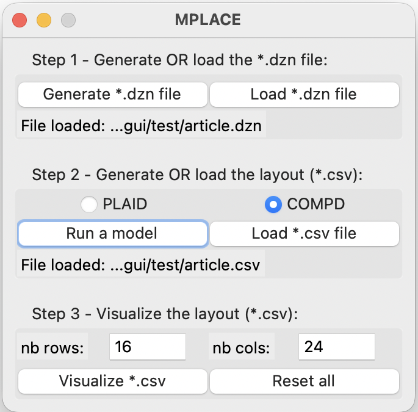
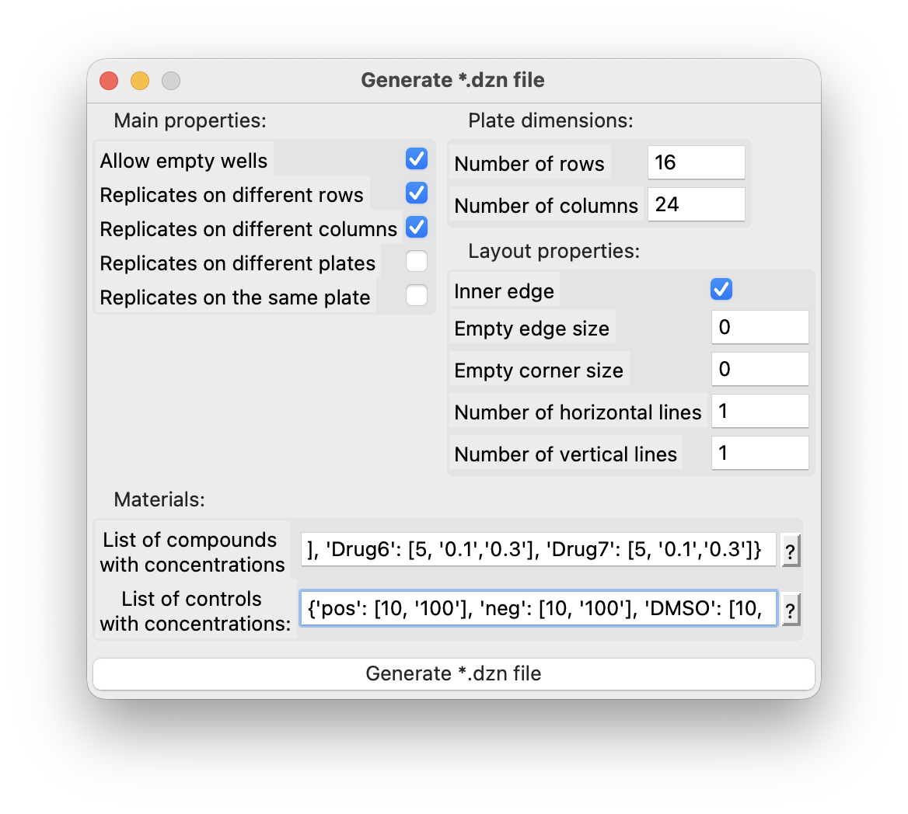
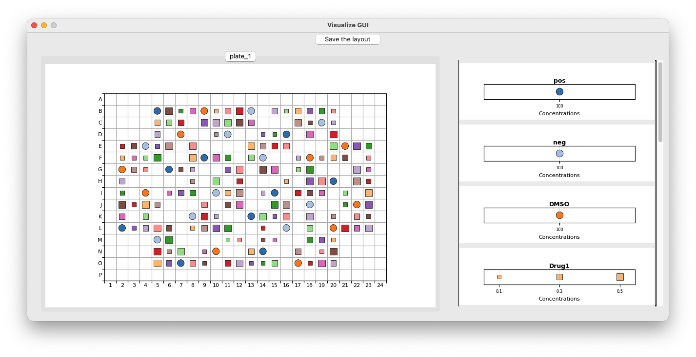

# MPLACE
[](https://opensource.org/licenses/Apache-2.0)

**MicroPlate Layout Arrangement with Constraint Engines**

MPLACE is a desktop app with a graphical interface for generating and visualizing microplate layouts. It runs MiniZinc models (e.g., [PLAID](https://github.com/pharmbio/plaid) and [COMPD](https://github.com/astra-uu-se/COMPD)) behind the scenes, so you don't need to write code. Typical use: define compounds/controls, produce plate layouts, and save figures for reports.

**Who is this for?**
- Biomedical researchers and lab staff who want to:
  - quickly generate microplate layouts from compounds/controls,
  - run a ready-made model (PLAID or COMPD),
  - visualize results without coding.


<!-- Main window -->
<p align="center">
  
</p>
<p align="center"><em>Main window: generate/load DZN, run model, load/visualize CSV.</em></p>


## Quick Start (about 5–10 minutes)

Follow these steps in order:

**Step 1: Install Python**
- Windows/macOS: Download and install Python 3.12 or newer from [python.org](https://python.org) (check "Add Python to PATH" on Windows).

**Step 2: Install Python packages**
- Open Terminal/Command Prompt and paste:
  - Windows: `pip install numpy matplotlib`
  - macOS/Linux: `python3 -m pip install numpy matplotlib`

**Step 3: Install MiniZinc**
- Download and install MiniZinc 2.6.4+ from [minizinc.org](https://minizinc.org)
- Note: PLAID requires the GeCode solver (bundled with MiniZinc).

**Step 4: Download MPLACE**
- Click "Code → Download ZIP" or clone the repo, then unzip.
- Open the unzipped folder in your file explorer.

**Step 5: Configure paths**
- Open `config/paths.ini` in a text editor and verify/edit:
  - `minizinc_path = "C:/Program Files/MiniZinc/minizinc.exe"` (Windows example)
  - `minizinc_path = "/Applications/MiniZincIDE.app/Contents/Resources/minizinc"` (macOS example)
  - `plaid_path = "mzn/plate-design.mzn"` (PLAID main model file, included)
  - `plaid_mpc_path = "mzn/plaid_default.mpc"`
  - `compd_path = "mzn/plate-optimizer.mzn"` (COMPD main model file, included)
  - `compd_mpc_path = "mzn/compd_default.mpc"`

**Step 6: Start the app**
- In Terminal/Command Prompt from the MPLACE folder:
  - Windows: `python mplace.py`
  - macOS/Linux: `python3 mplace.py`

If the window opens, you're ready to go.

## Installation (details)

**Requirements**
- Python 3.12+ (3.13 also tested; 3.11 on macOS may have issues)
- NumPy 2.1+ and Matplotlib 3.10+
- MiniZinc 2.6.4+ (GeCode solver required for PLAID)

**Install commands**
- Windows:
  ```
  pip install numpy matplotlib
  ```
- macOS/Linux:
  ```
  python3 -m pip install numpy matplotlib
  ```

**Known compatibility notes**
- If the app behaves oddly on Python 3.11/macOS, try Python 3.12 or 3.13.

## Configure (paths.ini explained)

Open `config/paths.ini` and check or edit the following lines:
- `minizinc_path`: full path to your MiniZinc executable
- `plaid_path`: the PLAID model file (included under mzn/, version of 30 September 2025)
- `compd_path`: the COMPD model file (included under mzn/, version 1.3.4)
- `plaid_mpc_path`, `compd_mpc_path`: solver configuration files (included under mzn/)

**Example (Windows):**
```ini
minizinc_path = "C:/Program Files/MiniZinc/minizinc.exe"
plaid_path = "mzn/plate-design.mzn"
compd_path = "mzn/plate-optimizer.mzn"
plaid_mpc_path = "mzn/plaid_default.mpc"
compd_mpc_path = "mzn/compd_default.mpc"
```

**Example (macOS):**
```ini
minizinc_path = "/Applications/MiniZincIDE.app/Contents/Resources/minizinc"
plaid_path = "mzn/plate-design.mzn"
compd_path = "mzn/plate-optimizer.mzn"
plaid_mpc_path = "mzn/plaid_default.mpc"
compd_mpc_path = "mzn/compd_default.mpc"
```

## Use the App (typical workflow)

**1) Generate or load a model file (*.dzn)**
- Click "Generate *.dzn file" to define:
  - Desired layout configurations
  - Rows/columns of the plate
  - Compounds and their concentrations
  - Controls and their concentrations
- Alternatively, click "Load *.dzn file" if you already have one.

*Tip: You can prepare the compound/control lists with the included Excel file `tools/Convert the compounds and controls.xlsx`.*

<!-- DZN file generation window -->
<p align="center">
  
</p>
<p align="center"><em>Main window: generate/load DZN, run model, load/visualize CSV.</em></p>

**2) Run the model to produce a layout (*.csv)**
- Click "Run a model".
- Choose PLAID or COMPD.
- After the model finishes, you'll be asked which **CSV format** to save:
  - **CSV (PharmBio)** — the default MPLACE format used for visualization and post-processing
  - **CSV (PLATER)** — a plate-shaped format compatible with the R `plater` package (one file per plate). See "Plater format" below.
- Save the resulting CSV file(s) when prompted.

**3) Load an existing layout (*.csv) (optional)**
- If you already have a layout file, click "Load *.csv file" (MPLACE recognizes both PharmBio and PLATER formats).

**4) Visualize the layout**
- Click "Visualize *.csv".
- A new window opens with:
  - Plate view tabs (one per layout)
  - A panel showing materials and concentration scales
- Click **"Save Layout(s)"** to export figures:
  - **Single plate:** Choose format (PNG or PDF) and save location
  - **Multiple plates:** Choose to save as individual PNG files or as a single multi-page PDF

<!-- Visualization -->
<p align="center">
  
</p>

**What the app produces**
- CSV: layout with wells and materials
- PNG/PDF: plate visualizations exported on demand from the visualization window
- Optional: Load a *.dzn file before visualizing to show controls as circles instead of squares

## Plater format (export)

MPLACE can export and import layouts to **PLATER-compatible CSV** files. The PLATER format is a plate-shaped CSV used by the R package `plater` to read, tidy, and visualize microtiter plates. Key points:

- **One file per plate**: PLATER expects each CSV to represent a single plate. If your run produces multiple plates, MPLACE will prompt you to save multiple CSVs (one per plate).
- **Multiple layouts (variables)** can be stored in one file by separating them with a blank row (e.g., Drug, Concentration, Treatment). The `plater::read_plate()` function converts these into tidy data.
- To read exported PLATER files in R:

```
library(plater)
df <- read_plate("layout_plater.csv") # single plate
dfs <- read_plates(c("plate1.csv","plate2.csv"), plate_names=c("P1","P2")) # multiple plates
```

MPLACE can load and visualize both formats. Use **PLATER** when your downstream analysis or data sharing requires the PLATER ecosystem. Otherwise, you can use the **PharmBio** format if you want to store information about multiple layouts into one file, as it is more convenient.


## Input Tips: Compounds/Controls Format

When generating a *.dzn, compounds and controls are entered as Python-like dictionaries, for example:
- **Compounds:**
  ```
  {'Drug1': [5, '0.1', '0.3'], 'Drug2': [10, '1']}
  ```
- **Controls:**
  ```
  {'pos': [8, '100'], 'neg': [8, '0'], 'DMSO': [16, '100']}
  ```

- The number is "replicates"
- Strings are concentrations (numbers or labels)
- Use single quotes as shown

## FAQ and Troubleshooting

**The app doesn't start**
- Ensure Python is installed and accessible from Terminal/Command Prompt (`python --version`).
- Try `python3` instead of `python` on macOS/Linux.

**"MiniZinc not found" or model fails to run**
- Check `minizinc_path` in `config/paths.ini`
- To locate MiniZinc installation:
  - Windows: Usually `C:/Program Files/MiniZinc/minizinc.exe`
  - macOS: Try `/Applications/MiniZincIDE.app/Contents/Resources/minizinc` or `/usr/local/bin/minizinc`
  - Linux: Try `/usr/bin/minizinc` or `which minizinc` in the terminal
- Ensure MiniZinc 2.6.4+ is installed with GeCode solver.

**The window opens, but visualization fails**
- Check that your CSV has data rows and a header.
- Try re-running the model and saving the CSV again.

**Colors repeat with many materials**
- Current palette has 60 distinct colors.

**Exported PLATER files**
- If multiple plates were generated, you will be prompted to save multiple files (one per plate). The completion dialog lists all saved file names.
- If your analysis requires PLATER, prefer exporting in PLATER format; otherwise, use PharmBio.

**How do I save figures?**
- After visualizing, click "Save Layout(s)" in the visualization window. For multiple plates, choose PNG (individual files) or PDF (single file with all plates).


## Advanced (optional)

**Switching solvers/threads**
- Edit `mzn/plaid_default.mpc` or `mzn/compd_default.mpc` to change solver settings (e.g., threads).

**Timeouts**
- For COMPD, you may need to increase the timeout from 180s to 300s (or higher) or higher if results are unsatisfactory.

**Models**
- The repo includes model files under `mzn/`. You can point `paths.ini` to other model files if needed.

## Roadmap Highlights

- Optional exports to standard formats (e.g., Wellmap TOML)
- Progress indicators for long runs
- Keyboard shortcuts

## Citation

The following manuscript in SoftwareX can be used to cite this project:

Gindullin, R., & Francisco Rodríguez, M. A. (2026). MPLACE: MicroPlate layout arrangement with constraint engines. SoftwareX, 34, 102584. [https://doi.org/10.1016/j.softx.2026.102584](https://doi.org/10.1016/j.softx.2026.102584)

```
@article{gindullin2026,
	author = {Gindullin, Ramiz and Francisco Rodr\'iguez, Mar\'ia Andre\'ina},
	title = {MPLACE: MicroPlate layout arrangement with constraint engines},
	year = {2026},
	doi = {10.1016/j.softx.2026.102584},
	URL = {https://doi.org/10.1016/j.softx.2026.102584},
	journal = {SoftwareX},
	volume = {34}
}
```

## Credits

MPLACE is developed by [Ramiz Gindullin](https://orcid.org/0000-0003-4947-9641) except:
- Several utility functions (used for string format validation and handling of recent files menu bar) were generated by Perplexity AI
- The Tooltips class is taken from [squareRoot17](https://stackoverflow.com/questions/20399243/display-message-when-hovering-over-something-with-mouse-cursor-in-python)

## License

MPLACE is under Apache 2.0 LICENSE. The author accepts no responsibility or liability for the use of the project or any direct or indirect damages arising out of its use.
